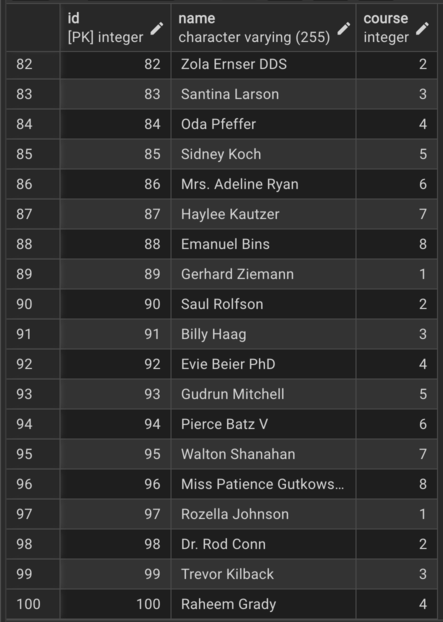
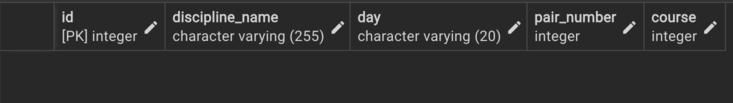
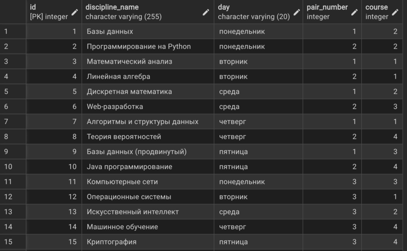

# Лабораторная работа 2

## Пункт 1

Создал базу данных study:

```sql
CREATE DATABASE study;
```

## Пункт 2

Скачал файл students.csv , создал таблицу students:

```sql
CREATE TABLE students (
    id SERIAL PRIMARY KEY,
    name VARCHAR(255) NOT NULL,
    course INTEGER NOT NULL CHECK (course BETWEEN 1 AND 8)
);
```

В качестве ограничений целостности использовал "SERIAL PRIMARY KEY", "NOT NULL", "CHECK".


После создания таблицы имортировал в нее данные из файла students.csv.
Итоговая таблица: 


## Пункт 3

Создал таблицу disciplines :  

```sql
CREATE TABLE disciplines (
    id SERIAL PRIMARY KEY,
    discipline_name VARCHAR(255) NOT NULL,
    day VARCHAR(20) NOT NULL CHECK (day IN (
        'понедельник', 'вторник', 'среда', 'четверг', 'пятница', 'суббота'
    )),
    pair_number INTEGER NOT NULL CHECK (pair_number BETWEEN 1 AND 9),
    course INTEGER NOT NULL CHECK (course BETWEEN 1 AND 8)
);
```

В качестве ограничений целостности использовал "SERIAL PRIMARY KEY" , "NOT NULL" , "CHECK".


После создания таблицы , вставил различные занятия для разных курсов.



