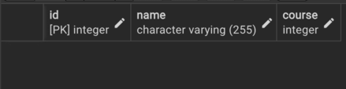

Пункт 1.
    Создал базу данных study - "CREATE DATABASE study";

Пункт 2.
    Скачал файл students.csv , создал таблицу - "CREATE TABLE students (
                                                    id SERIAL PRIMARY KEY,
                                                    name VARCHAR(255) NOT NULL,
                                                    course INTEGER NOT NULL 
                                                    CHECK (course BETWEEN 1 AND 8)
                                                );"

    В качестве ограничений целостности использовал "SERIAL PRIMARY KEY" ,
    "NOT NULL" , "CHECK (course_num BEETWEN 1 AND 8)".
    После создания таблицы имортировал в нее данные из файла students.csv.

    Итоговая таблица: 

Пункт 3.
